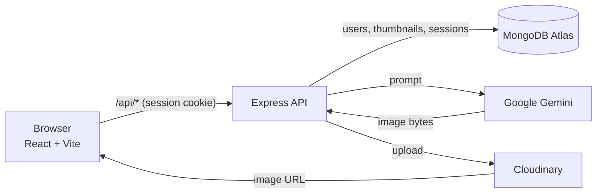

# ThumGEN – AI YouTube Thumbnail Generator

[](https://github.com/YasithaNV2001/ThumGEN/actions/workflows/ci.yml)

A full-stack **MERN + TypeScript** app that generates click-worthy YouTube thumbnails with Google Gemini. Users sign up, pick a style, color scheme and aspect ratio, generate a thumbnail, preview it inside a YouTube-style feed, and manage their history.

**Live demo:** _coming soon_

<!-- Add a screenshot: docs/screenshot.png -->

## Features

- **AI image generation**: prompts are built from the chosen style, color palette, aspect ratio (16:9, 1:1, 9:16), optional title overlay and the user's own details, then sent to Gemini
- **Session authentication**: bcrypt password hashing, httpOnly cookies, sessions stored in MongoDB, session regeneration on login
- **Credit system**: every account gets free credits; credits are spent atomically and refunded automatically if generation fails
- **History**: paginated gallery of past thumbnails with download, delete and YouTube preview
- **YouTube preview**: see the thumbnail in a realistic YouTube home feed before publishing
- **Protected routes** on the client with redirect back after login

## Engineering highlights

| Area | What's implemented |
|---|---|
| Validation | Every request body is validated with **zod** (types, lengths, enums, password strength) |
| Security | `helmet` headers, CORS allow-list, rate limiting (login/register per IP, generation per user), ownership checks on every thumbnail query, no internal errors leaked, XSS-safe preview page |
| Reliability | Env vars validated at startup, central error handler, no stuck "generating" records, credit refunds on AI failure |
| Cloud-ready | Images uploaded to Cloudinary straight from memory (works on read-only serverless file systems); Mongo connection reused across invocations |
| Testing | 17 integration tests (Vitest + Supertest + in-memory MongoDB) covering auth, validation, credits, refunds and access control; Gemini and Cloudinary are mocked |
| CI | GitHub Actions runs server typecheck + tests and client lint + build on every push |

## Tech stack

**Frontend:** React 19, TypeScript, Vite, Tailwind CSS 4, React Router 7, Axios, Motion
**Backend:** Node.js, Express 5, TypeScript, MongoDB + Mongoose, express-session + connect-mongo, zod
**Services:** Google Gemini (image generation), Cloudinary (image storage), Vercel (hosting)

## Architecture



```
ThumGEN/
├── client/                 # React app
│   └── src/
│       ├── pages/          # Home, Generate, My Generations, YouTube Preview, 404
│       ├── components/     # UI + ProtectedRoute
│       ├── context/        # AuthContext (session state, credits)
│       └── configs/api.ts  # Axios instance + error helper
└── server/                 # Express API
    ├── configs/            # env validation, DB, Gemini, Cloudinary
    ├── routes/ → controllers/ → services/ → models/
    ├── middlewares/        # auth, zod validation, rate limits, error handler
    ├── validators/         # zod schemas
    └── tests/              # integration tests
```

## API

| Method | Endpoint | Auth | Description |
|---|---|---|---|
| POST | `/api/auth/register` | – | Create account and start a session |
| POST | `/api/auth/login` | – | Log in |
| GET | `/api/auth/verify` | ✓ | Current user (incl. credits) |
| POST | `/api/auth/logout` | ✓ | End session |
| POST | `/api/thumbnail/generate` | ✓ | Generate a thumbnail (costs 1 credit) |
| DELETE | `/api/thumbnail/delete/:id` | ✓ | Delete own thumbnail (and its Cloudinary image) |
| GET | `/api/user/thumbnails?page=&limit=` | ✓ | Paginated list of own thumbnails |
| GET | `/api/user/thumbnails/:id` | ✓ | Single thumbnail |
| GET | `/api/health` | – | Health check |

## Run locally

**Prerequisites:** Node.js 20+, a MongoDB connection string (Atlas free tier works), a [Gemini API key](https://aistudio.google.com/apikey) with billing enabled, and a [Cloudinary](https://cloudinary.com) account.

```bash
git clone https://github.com/YasithaNV2001/ThumGEN.git
cd ThumGEN

# API
cd server
cp .env.example .env      # fill in the values
npm install
npm run dev               # http://localhost:3000

# Client (new terminal)
cd client
npm install
npm run dev               # http://localhost:5173
```

### Tests

```bash
cd server
npm test
```

No real keys are needed. The tests use an in-memory MongoDB and mock Gemini and Cloudinary.

## Deploy (Vercel)

1. Create two Vercel projects from this repo: one with root directory `server`, one with `client`.
2. Add the variables from `server/.env.example` to the server project, with `NODE_ENV=production` and `CLIENT_URL=https://<your-client>.vercel.app`.
3. In `client/vercel.json`, point the `/api` rewrite at your server URL. The client then calls the API on its own domain.
4. In MongoDB Atlas, allow network access from Vercel (`0.0.0.0/0`).
5. Set a budget alert in Google Cloud, since each generation is a paid Gemini call.
